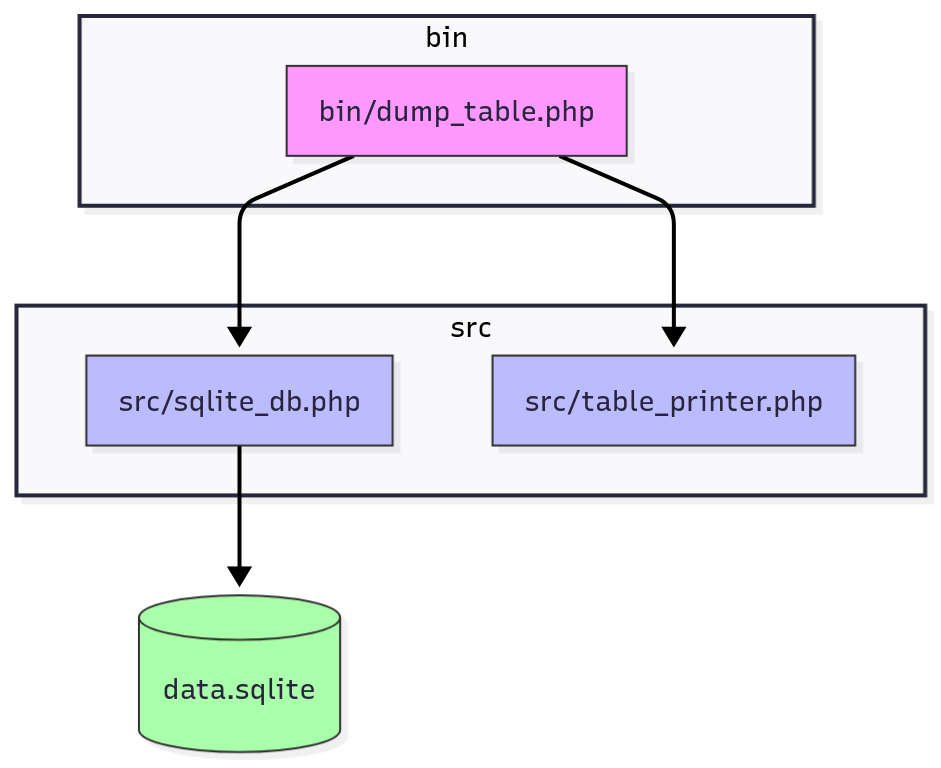

# Simple CLI in PHP

The app reads data from an SQLite table and shows it in the console.



## Run with PHP

```bash
php bin/dump_table.php [table_name]
```

Example:

```bash
php bin/dump_table.php users
```

## Run with Docker

```bash
docker build -t php-sqlite-cli . && docker run --rm php-sqlite-cli
```

## Run with Podman

```bash
podman build -t php-sqlite-cli . && podman run --rm php-sqlite-cli
```
